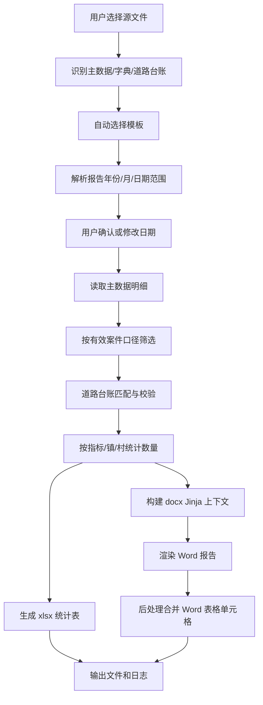

# 海淀区农村人居环境报告生成程序开发方案

本文档用于指导后续 Codex 实际开发 `Haidian-Resident-Word` 程序。目标是基于用户上传的原始 Excel 数据和模板文件，自动生成海淀区农村人居环境检查统计 xlsx 和分析报告 docx。前端采用 CustomTkinter，支持多文件上传、模板上传、日期范围解析与手动修改、运行状态展示、生成耗时展示。

开发必须遵守本项目要求：

1. 未经允许严禁修改原始模板文件。
2. 严禁把临时文件写入 C 盘。
3. 修改代码逻辑时同步检查 README、逻辑说明 md 等说明性文档是否需要更新。
4. 如果新增逻辑与旧逻辑冲突，必须及时提醒用户，并删除或隔离旧逻辑，避免旧逻辑继续生效。
5. 未明确要求打包压缩包时，不生成压缩包。

## 1. 当前已确认业务口径

### 1.1 输入文件

用户提供的原始数据位于 `data/2.人居报告`，当前样例包含 3 个 xlsx：

| 文件类型 | 样例文件 | 作用 |
| --- | --- | --- |
| 村庄与指标字典 | `0.人居村及指标类别.xlsx` | 提供人居村清单、指标小类到人居报告大类/次大类的映射 |
| 人居道路台账 | `0.农村人居道路202604--农业农村局道路台账-删除聂各庄东路.xlsx` | 用于识别涉及人居的道路；筛选现场检查数据时重点看 `街镇分中心`、`检查点位（3级）`、`道路`/道路名称 |
| 现场检查主数据 | `1.6月现场检查用数据.xlsx` | 主数据源，提交 xlsx 明细和 Word 报告统计均来自该文件 |

程序不能依赖固定文件名，必须通过工作表结构和表头语义自动识别文件类型。

### 1.2 输出文件

最终需要生成两个文件：

| 输出 | 要求 |
| --- | --- |
| `附件3：海淀区农村人居环境检查情况统计表.xlsx` | 统计各村、各指标问题数量；当前不计算分数 |
| `海淀区2026年x月份农村人居环境检查分析报告.docx` | 使用 Jinja/docxtpl 模板生成，最终结构和参考报告一致 |

当前已生成的 docx 模板参考路径：

`input/海淀区2026年6月份农村人居环境检查分析报告模板.docx`

参考提交文档：

`data/2.人居报告/提交格式/海淀区2026年6月份农村人居环境检查分析报告(1).docx`

参考提交 xlsx：

`data/2.人居报告/提交格式/附件3：海淀区农村人居环境检查情况统计表-城环建平台（6月）(1).xlsx`

### 1.3 不再开发的逻辑

用户已确认：当前不计算分数，只统计问题数量。因此程序不要开发以下逻辑：

1. 村庄常驻人口系数。
2. 市级垃圾分类示范小区台账。
3. 严重问题/普通问题扣分。
4. 扣分合计。
5. 最终得分。
6. 合格情况。

如果从参考 xlsx 中复制模板格式，必须删除或禁用旧评分公式，避免它继续生效。

### 1.4 检查轮次

每月检查轮次固定为 2 次。

Word 报告中：

`每轮平均问题数 = round(问题总数 / 2)`

该值只用于文字展示，不参与扣分。

### 1.5 数据明细

提交 xlsx 的 `数据明细` 按当前括号别名匹配口径只输出有效案件明细；6 月样例源数据当前纳入 664 条有效案件。样例第 1 行为表头，没有需要保留的尾部空白格式行。

## 2. 推荐技术栈

| 层 | 技术 |
| --- | --- |
| GUI | CustomTkinter |
| Excel 读取/写入 | openpyxl |
| Word 模板渲染 | docxtpl |
| Word 后处理 | python-docx + 必要时 OOXML |
| 数据处理 | Python 标准库 + dataclasses + collections |
| 打包 | PyInstaller，用户明确要求时再打包 |

不建议使用 pandas 作为核心依赖，原因是该项目需要保留 Excel 样式、合并单元格、公式/格式框架，openpyxl 更适合。

## 3. 推荐目录结构

建议开发后目录如下：

```text
E:\Haidian\Haidian-Resident-Word
├─ app.py
├─ README.md
├─ requirements.txt
├─ config
│  ├─ default_rules.yaml
│  └─ field_aliases.yaml
├─ input
│  ├─ 附件3：海淀区农村人居环境检查情况统计表模板.xlsx
│  └─ 海淀区2026年6月份农村人居环境检查分析报告模板.docx
├─ output
│  └─ .gitkeep
├─ src
│  ├─ __init__.py
│  ├─ models.py
│  ├─ file_classifier.py
│  ├─ excel_reader.py
│  ├─ data_filter.py
│  ├─ road_matcher.py
│  ├─ statistics_builder.py
│  ├─ xlsx_writer.py
│  ├─ docx_context.py
│  ├─ docx_writer.py
│  ├─ word_postprocess.py
│  ├─ validation.py
│  └─ utils.py
├─ tests
│  ├─ test_file_classifier.py
│  ├─ test_data_filter.py
│  ├─ test_statistics_builder.py
│  ├─ test_docx_context.py
│  └─ test_word_postprocess.py
├─ 人居报告生成逻辑对应关系.md
└─ 农村人居环境报告生成程序开发方案.md
```

所有运行期临时目录必须位于项目目录内，例如：

```text
E:\Haidian\Haidian-Resident-Word\.runtime
E:\Haidian\Haidian-Resident-Word\output
```

不得使用 C 盘作为临时目录。

## 4. GUI 前端设计

前端使用 CustomTkinter。主窗口建议标题：

`海淀区农村人居环境报告生成工具`

### 4.1 页面布局

从上到下分 6 个区域：

1. 源文件上传区。
2. 模板上传区。
3. 日期范围与报告月份区。
4. 输出设置区。
5. 运行控制区。
6. 状态与日志区。

### 4.2 源文件上传区

控件要求：

| 控件 | 行为 |
| --- | --- |
| `选择源文件` 按钮 | 点击后打开文件弹窗，支持多选 xlsx/xlsm/xls 文件 |
| 已选文件列表 | 在前端展示用户选择的所有文件路径或文件名 |
| `清空` 按钮 | 清空已选源文件 |
| 文件识别状态 | 显示每个文件被识别为何种类型：主数据、村指标字典、道路台账、未知 |

文件弹窗使用：

```python
filedialog.askopenfilenames(
    title="选择源数据文件",
    filetypes=[("Excel files", "*.xlsx *.xlsm *.xls"), ("All files", "*.*")]
)
```

源文件支持多选。用户选择后立即执行轻量识别，不做完整计算。

### 4.3 模板上传区

控件要求：

| 控件 | 行为 |
| --- | --- |
| 自动选择模板提示 | 程序启动时优先自动扫描 `input` 目录 |
| Word 模板路径 | 展示自动选中的 docx 模板 |
| xlsx 模板路径 | 展示自动选中的 xlsx 模板 |
| `选择 Word 模板` 按钮 | 打开 docx 文件选择弹窗 |
| `选择 xlsx 模板` 按钮 | 打开 xlsx 文件选择弹窗 |

模板自动选择优先级：

1. `input/海淀区2026年6月份农村人居环境检查分析报告模板.docx`
2. `input/*农村人居环境检查分析报告模板*.docx`
3. `data/2.人居报告/提交格式/*农村人居环境检查分析报告*.docx` 仅作为参考，不建议直接写入

xlsx 模板自动选择优先级：

1. `input/附件3：海淀区农村人居环境检查情况统计表模板.xlsx`
2. `input/*农村人居环境检查情况统计表模板*.xlsx`
3. `data/2.人居报告/提交格式/*农村人居环境检查情况统计表*.xlsx` 仅作为参考，不建议直接写入

如果模板不存在，前端显示黄色提示：

`未找到模板，请手动选择模板文件。`

### 4.4 日期范围与报告月份区

用户要求“下一栏是解析出的日期范围，支持动态修改”。

建议控件：

| 字段 | 默认值来源 | 是否可改 |
| --- | --- | --- |
| 报告年份 | 从主数据 `月份`、上报时间、截止时间或文件名推断 | 可改 |
| 报告月份 | 从 `月份` 列取唯一值，例如 `6月` | 可改 |
| 数据开始日期 | 从有效候选数据的 `上报时间` 最小值或文件名推断 | 可改 |
| 数据结束日期 | 从有效候选数据的 `截止时间`/报告月末推断 | 可改 |
| 检查轮次 | 固定默认 2 | 可改但默认锁定为 2，旁边标注“已确认固定” |

日期解析规则：

1. 优先读取主数据 `月份` 列，例如 `6月`。
2. 年份优先从 `上报时间`、`截止时间` 中读取，例如 `2026-06-xx`。
3. 如果数据跨多个月，前端要提示用户选择报告月份。
4. 如果 `月份` 列缺失，再尝试从文件名解析，例如 `1.6月现场检查用数据.xlsx`。
5. 用户修改后，所有输出文件名、Word 标题、表标题、正文日期都以用户界面中的值为准。

### 4.5 输出设置区

控件：

| 控件 | 默认值 |
| --- | --- |
| 输出目录 | `output/YYYYMMDD_HHMMSS` |
| 输出文件名前缀 | 自动按报告年月生成 |
| 是否打开输出目录 | 默认勾选 |

输出文件名建议：

```text
附件3：海淀区农村人居环境检查情况统计表-城环建平台（{month}月）.xlsx
海淀区{year}年{month}月份农村人居环境检查分析报告.docx
道路匹配校验清单.xlsx
运行日志.txt
```

### 4.6 运行控制区

控件：

| 控件 | 行为 |
| --- | --- |
| `生成报告` 按钮 | 开始运行完整流程 |
| `取消` 按钮 | 可选，后续开发；第一版可以禁用 |
| 进度条 | 展示 indeterminate 或分阶段进度 |

运行按钮点击后要禁用上传按钮，避免运行中修改输入。

### 4.7 状态与日志区

必须展示运行状态和用时。

建议状态阶段：

1. `等待选择文件`
2. `正在识别源文件...`
3. `正在读取主数据...`
4. `正在匹配道路台账...`
5. `正在统计问题数量...`
6. `正在生成统计表...`
7. `正在生成 Word 报告...`
8. `正在合并 Word 表格单元格...`
9. `生成完成，用时 xx 秒`
10. `生成失败：错误原因`

日志区使用 `CTkTextbox`，每个阶段写入一行。运行完成后显示：

```text
生成完成
用时：12.36 秒
输出目录：E:\Haidian\Haidian-Resident-Word\output\20260814_142000
```

## 5. 文件识别逻辑

不能依赖文件名，必须通过工作表和表头识别。

### 5.1 主数据文件识别

满足以下特征即识别为主数据：

1. 存在一个工作表，列数约 42 列。
2. 表头包含：
   - `月份`
   - `编号`
   - `案件来源`
   - `案件状态`
   - `案件分类`
   - `上报时间`
   - `检查点位（1级）`
   - `检查点位（2级）`
   - `检查点位（3级）`
   - `检查指标（1级）`
   - `检查指标（2级）`
   - `检查指标（3级）`
   - `街镇分中心`
   - `上报扣分案件`
   - `解决案件库`

### 5.2 村指标字典识别

满足以下特征：

1. 有 `人居村` 工作表，表头包含 `街镇名称`、`人居村`。
2. 有 `人居指标` 工作表，表头包含 `大类名称`、`次大类`、`小类名称`。

### 5.3 道路台账识别

满足以下特征：

1. 表头包含：
   - `所属街道`
   - `小区（村）名称`
   - `道路`
   - `备注-别名`
2. 可选辅助列为村名+道路拼接。

### 5.4 未知文件处理

如果上传文件无法识别：

1. 前端在文件列表中标红或显示“未知文件”。
2. 运行时阻止继续，提示用户删除或更换文件。
3. 不要静默忽略未知文件。

## 6. 数据处理流程

整体流程：



### 6.1 主数据标准化

读取主数据后转换为统一对象：

```python
@dataclass
class CaseRecord:
    month: str
    remark: str
    case_id: str
    source: str
    status: str
    case_category: str
    report_unit: str
    report_time: datetime | None
    deadline_time: datetime | None
    close_time: datetime | None
    area: str
    community: str
    description: str
    tags: str
    road: str
    park: str
    point_level_1: str
    point_level_2: str
    point_level_3: str
    indicator_level_1: str
    indicator_level_2: str
    indicator_level_3: str
    street_center: str
    district_department: str
    rectification_unit: str
    is_deduct_case: str
    is_solved: str
```

字段读取必须基于表头名，不使用固定列号。

### 6.2 有效案件筛选

当前样例口径来自提交文件反推，并结合已确认要求：

| 字段 | 规则 |
| --- | --- |
| `月份` | 等于界面选择的报告月份，例如 `6月` |
| `检查点位（1级）` | 样例为 `北部地区`，建议做成配置项 |
| `上报扣分案件` | 样例有效数据均为 `是`，建议默认筛 `是` |
| `案件状态` | 样例均为 `结案`，建议默认筛 `结案`，但做成可配置 |
| `解决案件库` | 用于计算解决率，不建议作为强制筛选条件，除非用户后续确认 |

注意：样例中 `备注` 为 `现场检查` 的 661 条，`视频监控` 2 条也进入统计。因此不要用 `备注=现场检查` 作为唯一筛选条件。

### 6.3 道路台账匹配

用户已确认道路台账口径：

> 道路台账只看提供材料里的，涉及人居的道路；从现场检查数据里筛选时着重看 `街镇分中心`、`检查点位（3级）`、`道路名称`。

程序实现：

```python
@dataclass
class RoadLedgerEntry:
    street: str
    village: str
    road: str
    alias: str
    normalized_keys: set[str]
```

道路匹配键：

1. 标准键：`normalize(所属街道) + normalize(小区（村）名称) + normalize(道路)`
2. 别名键：`normalize(所属街道) + normalize(小区（村）名称) + normalize(备注-别名)`
3. 兼容键：`normalize(小区（村）名称) + normalize(道路)`

道路名称按括号情况分别匹配：源道路名无括号时，只用完整道路名匹配台账 `道路` 列；源道路名带括号时，只取第一组括号内名称匹配台账 `备注-别名` 列，匹配失败不纳入统计。`前章村路（前章村主路）` 为已确认特例，直接用完整带括号道路名匹配台账 `道路` 列。

现场检查记录匹配键：

1. `街镇分中心 + 检查点位（3级） + 道路`
2. 如果 `街镇分中心` 为空，尝试 `检查点位（2级） + 检查点位（3级） + 道路`
3. 如果 `道路` 为空，标记为 `ROAD_EMPTY`

匹配结果：

| 状态 | 含义 | 处理 |
| --- | --- | --- |
| `MATCHED` | 命中道路台账 | 可正常纳入统计 |
| `MATCHED_ALIAS` | 命中别名 | 可正常纳入统计，并记录别名命中 |
| `ROAD_EMPTY` | 道路字段为空 | 纳入校验清单，是否统计由配置决定 |
| `ROAD_NOT_IN_LEDGER` | 道路未命中台账 | 纳入校验清单，不能静默剔除 |
| `VILLAGE_NOT_IN_LEDGER` | 镇村未命中道路台账 | 纳入校验清单 |

建议第一版配置：

```yaml
road_filter:
  enabled: true
  unmatched_policy: "warn_and_keep"
```

也就是说：先做道路匹配和校验，未按括号别名规则命中道路台账的记录不纳入正式统计；道路为空且不是 `考评上报` 的记录按当前统计口径纳入。

### 6.4 指标映射

从 `0.人居村及指标类别.xlsx` 的 `人居指标` 读取映射：

| 字典字段 | 程序字段 |
| --- | --- |
| `大类名称` | `category_name` |
| `次大类` | `subcategory_name` |
| `小类名称` | `indicator_level_3` |

有效案件按 `检查指标（3级）` 映射到报告大类。

如果出现未映射指标：

1. 不要丢弃。
2. 加入 `未映射指标清单`。
3. 前端状态显示警告。
4. 输出校验清单。

### 6.5 村庄清单

从 `人居村` 工作表读取 24 个村。统计表行顺序以该字典为准。

村名匹配要做规范化：

1. 去除首尾空格。
2. 全角半角统一。
3. 可选：村名显示时保留或去除末尾“村”要分开处理。

内部匹配使用完整村名，例如 `柳林村`。

报告显示按参考文档使用完整村名。

统计 xlsx 中如果参考样式去掉“村”，可在 xlsx writer 中单独做 `display_village_name`。

## 7. 统计结果设计

建议核心统计对象：

```python
@dataclass
class ReportStats:
    total_problem_count: int
    resolved_count: int
    resolved_rate: float
    average_per_round: int
    category_rows: list[CategoryRow]
    problem_type_rows: list[ProblemTypeRow]
    town_rows: list[TownRow]
    village_rows: list[VillageRow]
    category_analysis_items: list[AnalysisItem]
    high_frequency_problem_items: list[AnalysisItem]
    validation_warnings: list[ValidationWarning]
```

### 7.1 表 1：问题大类统计

字段：

```python
CategoryRow(
    seq: int | str,
    name: str,
    count: int,
    rate: float,
    rate_text: str
)
```

排序按参考报告大类顺序：

1. 农村生活垃圾治理
2. 村容村貌整治
3. 农村生活污水
4. 农村厕所革命

最后追加总计行。

### 7.2 表 2：具体问题类型统计

字段：

```python
ProblemTypeRow(
    seq: int,
    category_name: str,
    problem_name: str,
    count: int,
    rate: float,
    rate_text: str
)
```

排序规则：

1. 默认按问题数量降序。
2. 如果参考报告需要按大类分组展示，可配置为 `category_then_count_desc`。

当前参考报告表 2 展示了具体问题及数量，例如：

1. 清扫保洁不到位
2. 积存垃圾
3. 非法小广告
4. 堆物堆料
5. 路面破损

### 7.3 表 3：各镇问题情况

字段：

```python
TownRow(
    seq: int,
    town_name: str,
    count: int,
    rate: float,
    rate_text: str
)
```

排序按参考报告或字典顺序，不能因为数量变化导致镇顺序乱跳，除非用户要求。

### 7.4 表 4：各村问题情况

字段：

```python
VillageRow(
    town_name: str,
    village_name: str,
    garbage_count: int,
    village_appearance_count: int,
    sewage_count: int,
    toilet_count: int,
    total_count: int
)
```

表 4 按镇分组，镇内按 `total_count` 降序。

如果某村当月 0 问题，是否展示：

1. Word 表 4 建议只展示有问题的村，保持报告简洁。
2. xlsx `sheet1` 建议展示全部 24 个村，便于提交统计。

该差异要写入 README。

## 8. Word 模板设计

### 8.1 模板文件

模板路径：

`input/海淀区2026年6月份农村人居环境检查分析报告模板.docx`

模板使用 Jinja/docxtpl 语法。

正文变量：

| 变量 | 含义 |
| --- | --- |
| `report_year` | 报告年份，例如 2026 |
| `report_month` | 报告月份数字，例如 6 |
| `town_join_text` | 镇名连接文本，例如 `苏家坨和上庄` |
| `town_count` | 镇数量 |
| `village_count` | 村数量 |
| `inspection_rounds` | 检查轮次，固定 2 |
| `total_problem_count` | 问题总数 |
| `average_problem_count_per_round` | 每轮平均问题数 |
| `resolved_rate_text` | 解决率文本，例如 `100%` |
| `category_join_text` | 大类连接文本 |
| `top_category` | 问题最多的大类 |
| `high_frequency_names_text` | 高频问题名称连接文本 |
| `high_frequency_total_count` | 高频问题总数 |
| `high_frequency_total_rate_text` | 高频问题占比 |
| `town_problem_summary_text` | 各镇问题情况正文 |
| `village_problem_summary_text` | 各村问题情况正文 |

循环变量：

| 变量 | 用途 |
| --- | --- |
| `category_analysis_items` | “问题项目分析”下面的 1、2、3、4 段 |
| `high_frequency_problem_items` | 高频问题下面的 1、2、3 段 |
| `category_rows` | 表 1 |
| `problem_type_rows` | 表 2 |
| `town_rows` | 表 3 |
| `village_rows` | 表 4 |

### 8.2 合并单元格策略

用户已确认采用方案一：

> 先生成 Word，再用代码进行单元格合并，并且代码要有普适性。

开发要求：

1. Jinja 模板中的表格不要预先合并单元格。
2. docxtpl 渲染后，得到普通规则表格。
3. 在 Word 后处理阶段，根据配置对指定表格、指定列进行纵向合并。
4. 合并逻辑必须通用，不为某一个表硬编码具体行数。

### 8.3 通用纵向合并设计

建议实现：

```python
@dataclass
class MergeRule:
    table_index: int
    column_index: int
    start_row: int = 1
    key_columns: tuple[int, ...] = (0,)
    merge_empty: bool = False
```

用于表 4：

```python
MergeRule(
    table_index=3,
    column_index=0,
    start_row=1,
    key_columns=(0,),
    merge_empty=False
)
```

解释：

1. `table_index=3` 表示第 4 张表。
2. `column_index=0` 表示合并第 1 列“镇”。
3. `start_row=1` 表示跳过表头，从第 2 行开始。
4. 连续行该列文本相同才合并。
5. 空值默认不合并。

通用函数：

```python
def merge_vertical_same_cells(docx_path: Path, output_path: Path, rules: list[MergeRule]) -> None:
    doc = Document(docx_path)
    for rule in rules:
        table = doc.tables[rule.table_index]
        merge_same_cells_in_column(table, rule)
    doc.save(output_path)
```

核心算法：

```python
def merge_same_cells_in_column(table, rule):
    start = rule.start_row
    col = rule.column_index
    group_start = start
    last_key = get_merge_key(table.rows[start], rule)

    for row_idx in range(start + 1, len(table.rows) + 1):
        if row_idx < len(table.rows):
            current_key = get_merge_key(table.rows[row_idx], rule)
        else:
            current_key = None

        if current_key != last_key:
            group_end = row_idx - 1
            if should_merge(last_key, group_start, group_end, rule):
                table.cell(group_start, col).merge(table.cell(group_end, col))
                table.cell(group_start, col).text = last_key
            group_start = row_idx
            last_key = current_key
```

注意事项：

1. 合并前表格必须是规则表格，不能已有复杂合并。
2. 合并后要重新设置单元格垂直居中和水平居中。
3. 如果需要按多列判断，例如同镇同类别合并，可使用 `key_columns=(0, 1)`。
4. 如果某一列重复值不连续，不跨段合并，只合并连续段。

### 8.4 表格合并配置文件

建议放到 `config/default_rules.yaml`：

```yaml
word_postprocess:
  merge_rules:
    - table_name: "village_rows"
      table_index: 3
      column_index: 0
      start_row: 1
      key_columns: [0]
      merge_empty: false
```

这样后续如果其他表也要合并，只改配置，不改核心代码。

## 9. xlsx 统计表生成

### 9.1 模板策略

优先使用：

`input/附件3：海淀区农村人居环境检查情况统计表模板.xlsx`

如果不存在，可先从参考提交 xlsx 复制格式生成模板，但必须得到用户确认后再新增模板文件。

### 9.2 写入内容

工作表建议：

| 工作表 | 内容 |
| --- | --- |
| `sheet1` | 村级问题数量统计表 |
| `数据明细` | 有效案件明细 |
| `道路匹配校验` | 道路为空、未命中、别名命中等校验结果 |
| `未映射指标` | 主数据中没有映射到人居指标的小类 |

如果必须完全匹配提交格式，可保留 `sheet1`、`数据明细`、`Sheet2` 三个工作表，并把额外校验清单另存为单独 xlsx。

### 9.3 `sheet1` 字段

用户已补充确认：`sheet1` 中以下前置列全部不用管，程序不要读取、不要计算、不要写入业务结果：

| 列 | 处理 |
| --- | --- |
| A | 序号，不处理 |
| B | 乡镇，不处理 |
| C | 村，不处理 |
| D | 普通问题点位合计平均数，不处理 |
| E | 严重问题点位合计平均数，不处理 |
| F | 扣分合计，不处理 |
| G | 最终得分，不处理 |
| H | 合格情况，不处理 |
| I | 是否拆迁腾退或棚改村庄，不处理 |
| J-AB | 各指标问题数，程序只负责统计并写入这些指标数量列 |

开发要求：

1. 程序核心统计只面向 J:AB 指标问题数。
2. A:I 列不参与统计逻辑，不作为校验依据，不生成得分，不生成合格情况。
3. 如果使用 xlsx 模板，A:I 的样式、表头和原有内容可以由模板自然保留；程序不要主动改写这些列。
4. 如果复制参考提交表作为模板，必须注意不要让 D:H 的旧公式影响程序判断；程序不读取这些公式结果。
5. 写入 J:AB 后，汇总行如需展示指标总数，只汇总 J:AB；不要生成 D:H 的汇总公式。

### 9.4 `数据明细`

从源 `数据` 工作表复制 37 个目标字段，删除：

1. `月份`
2. `备注`
3. `序列`
4. `整改责任单位-报告`
5. 其他参考样例不输出字段

字段映射必须基于表头名。

## 10. Word 上下文生成

实现 `docx_context.py`：

```python
def build_docx_context(stats: ReportStats, options: ReportOptions) -> dict:
    return {
        "report_year": options.report_year,
        "report_month": options.report_month,
        "inspection_rounds": 2,
        ...
    }
```

文本摘要生成规则：

### 10.1 镇名连接

如果 2 个镇：

`苏家坨和上庄`

如果超过 2 个：

`A、B和C`

注意：参考报告中镇名在开头句写为“苏家坨和上庄2镇”，没有每个都带“镇”字。需要提供：

1. `town_join_text`：不带最后的数量和“镇”。
2. `town_count`：数量。

### 10.2 大类连接

例如：

`农村生活垃圾治理、村容村貌整治、农村生活污水和农村厕所革命`

### 10.3 大类下村庄摘要

参考句式：

`涉及上庄镇皂甲屯村（35个），常乐村（30个），后章村和前章村（各26个）等24个村`

开发可以第一版简化为：

`涉及{top_village_summary}等{village_count}个村`

但函数要独立：

```python
def build_village_summary_for_category(category_name, rows) -> str:
    ...
```

### 10.4 高频问题摘要

参考句式：

`主要集中在上庄镇皂甲屯村（31个）、常乐村（29个）等24个村`

开发要求：

1. 统计每个具体问题在各村的数量。
2. 取前 2-3 个村。
3. 生成自然语言摘要。

### 10.5 各镇摘要

表 3 同步生成：

`苏家坨镇发现问题154个，占比23.23%，上庄镇发现问题509个，占比76.77%`

### 10.6 各村摘要

参考句式：

`苏家坨镇问题较多的村为西埠头村35个，台头村和柳林村各22个，上庄镇问题较多的村为皂甲屯村58个、前章村56个`

实现：

1. 每个镇取前 2-3 个村。
2. 如果两个村数量相同，生成“台头村和柳林村各22个”。
3. 如果数量不同，生成“皂甲屯村58个、前章村56个”。

## 11. 错误处理和校验

### 11.1 启动前校验

点击“生成报告”前检查：

1. 是否选择主数据文件。
2. 是否选择村指标字典。
3. 是否选择道路台账。
4. 是否选择 Word 模板。
5. 是否选择 xlsx 模板或允许从参考样例生成。
6. 报告年份、月份是否有效。
7. 输出目录是否可写。

### 11.2 数据校验

必须输出或展示以下校验：

| 校验 | 处理 |
| --- | --- |
| 未识别文件 | 阻止运行 |
| 缺少必需字段 | 阻止运行 |
| 道路为空 | 警告，输出清单 |
| 道路未命中台账 | 警告，输出清单 |
| 指标未映射 | 警告，输出清单 |
| 村庄不在字典 | 警告，输出清单 |
| 有效数据为 0 | 阻止生成 |

### 11.3 日志

生成 `运行日志.txt`，内容包括：

1. 输入文件路径。
2. 自动识别结果。
3. 模板路径。
4. 报告年月。
5. 有效案件数量。
6. 道路匹配统计。
7. 未映射指标数量。
8. 输出文件路径。
9. 总耗时。
10. 异常堆栈，如果失败。

## 12. 测试方案

### 12.1 单元测试

| 测试 | 内容 |
| --- | --- |
| `test_file_classifier.py` | 能识别 3 类源文件，未知文件报错 |
| `test_data_filter.py` | 6 月样例按括号别名匹配口径能筛出 664 条有效案件 |
| `test_road_matcher.py` | 标准道路、别名道路、空道路、未命中道路分类正确 |
| `test_statistics_builder.py` | 表 1 总计 664，各大类数量与当前口径一致 |
| `test_docx_context.py` | 生成的文字摘要和样例一致或接近 |
| `test_word_postprocess.py` | 表 4 连续相同镇名单元格可正确纵向合并 |

### 12.2 集成测试

用当前 `data/2.人居报告` 样例运行：

预期：

1. 有效案件 664 条。
2. 表 1：
   - 农村生活垃圾治理 338
   - 村容村貌整治 304
   - 农村生活污水 21
   - 农村厕所革命 1
3. 表 2 高频问题：
   - 清扫保洁不到位 292
   - 非法小广告 124
   - 堆物堆料 122
4. 表 3：
   - 苏家坨镇 148
   - 上庄镇 509
5. Word 报告成功生成。
6. 表 4 第一列镇名按连续分组合并。

### 12.3 GUI 测试

手动测试：

1. 点击源文件添加按钮，弹出多选文件框。
2. 支持一次选择多个 xlsx，也支持分批添加；界面显示去重后的已选文件。
3. 文件识别结果正确。
4. 模板自动选择成功。
5. 日期范围自动解析，可手动修改。
6. 点击生成后进度状态逐步变化。
7. 生成结束显示用时。
8. 输出目录包含两个目标文件和校验/日志文件。

## 13. 开发步骤

建议按以下顺序开发，避免前端先行导致核心逻辑不可测：

1. 新建 `src/models.py`，定义数据对象。
2. 新建 `src/file_classifier.py`，实现文件类型识别。
3. 新建 `src/excel_reader.py`，按表头读取 3 类 Excel。
4. 新建 `src/data_filter.py`，实现有效案件筛选。
5. 新建 `src/road_matcher.py`，实现道路台账匹配和校验清单。
6. 新建 `src/statistics_builder.py`，实现表 1-4 所有统计。
7. 新建 `src/docx_context.py`，生成 Jinja 上下文。
8. 新建 `src/docx_writer.py`，用 docxtpl 渲染 Word。
9. 新建 `src/word_postprocess.py`，实现通用合并单元格。
10. 新建 `src/xlsx_writer.py`，生成统计 xlsx 和数据明细。
11. 写单元测试，先跑通 6 月样例。
12. 开发 `app.py` CustomTkinter 前端。
13. 前端接入后台流程，加入线程和日志回调。
14. 更新 README。
15. 如用户要求，再用 PyInstaller 打包 exe。

## 14. 前端线程设计

GUI 不能在主线程执行耗时任务，否则界面会卡死。

建议：

```python
def on_generate_clicked():
    disable_controls()
    start_time = time.perf_counter()
    worker = threading.Thread(target=run_pipeline_worker, daemon=True)
    worker.start()
```

后台线程通过 `queue.Queue` 向主线程发消息：

```python
queue.put(("status", "正在读取主数据..."))
queue.put(("progress", 30))
queue.put(("log", "有效案件：664 条"))
queue.put(("done", output_paths))
queue.put(("error", traceback_text))
```

主线程用 `after()` 定时读取队列：

```python
root.after(100, poll_queue)
```

## 15. 打包要求

只有用户明确要求打包时才打包。

PyInstaller 注意事项：

1. 包含 `input` 默认模板。
2. 包含 `config` 默认配置。
3. 输出目录仍在 exe 所在目录下的 `output`。
4. 临时目录设置到项目/运行目录下，不使用 C 盘。
5. 打包后必须烟测：启动 GUI、选择样例文件、生成输出。

## 16. README 需要写明

开发完成后 README 至少包含：

1. 程序用途。
2. 输入文件要求。
3. 模板文件位置。
4. 操作步骤。
5. 当前业务口径：
   - 只统计问题数量。
   - 不计算分数。
   - 每月固定 2 次检查。
   - 道路台账用于道路识别和校验。
6. 输出文件说明。
7. 常见错误说明：
   - 文件无法识别。
   - 缺少模板。
   - 道路未命中。
   - 指标未映射。

## 17. 关键风险

1. 参考 xlsx 内仍有评分公式，复制模板时必须删除或禁用，否则旧逻辑会继续生效。
2. 道路台账匹配口径可能影响统计数量，第一版必须输出校验清单并保留匹配统计。
3. Word 表格如果预先合并单元格，会破坏 docxtpl 表格循环；必须先渲染，再后处理合并。
4. 中文路径和 PowerShell 编码容易出问题，程序内部尽量使用 `Path` 对象和 UTF-8 配置文件。
5. 用户可能上传 `.xls`，openpyxl 不支持老式 xls；第一版可提示仅支持 xlsx/xlsm，或后续增加转换支持。

## 18. 第一版完成标准

第一版开发完成必须满足：

1. CustomTkinter GUI 可启动。
2. 支持多选上传源文件。
3. 已选源文件在前端显示。
4. 自动识别主数据、村指标字典、道路台账。
5. 自动选择模板，允许手动改模板。
6. 自动解析报告年份、月份、日期范围，允许手动修改。
7. 生成过程中显示运行状态。
8. 生成完成后显示总用时。
9. 生成 xlsx 统计表。
10. 生成 docx 分析报告。
11. Word 表 4 镇名单元格渲染后自动合并。
12. 输出道路匹配校验清单。
13. 输出运行日志。
14. 使用当前样例数据时，核心统计结果与参考报告一致。
